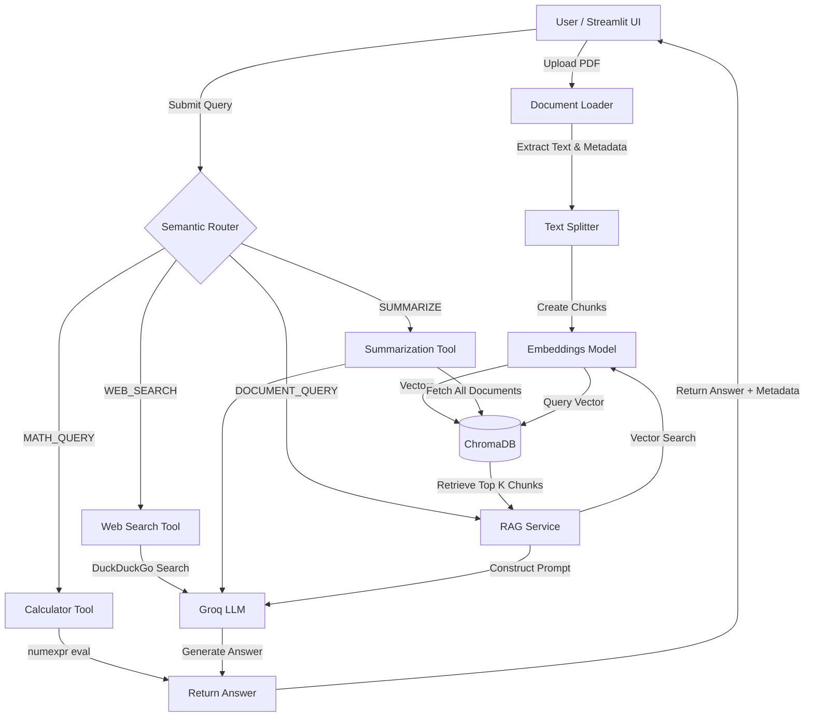
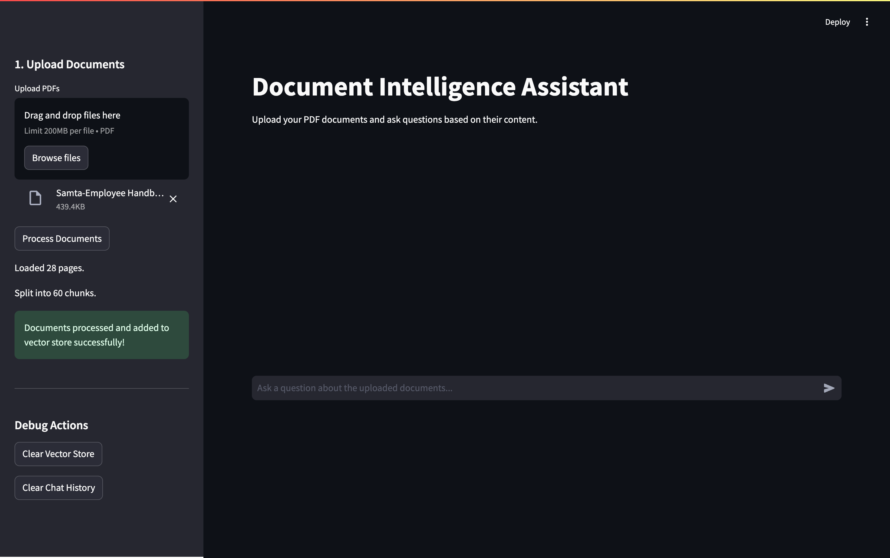
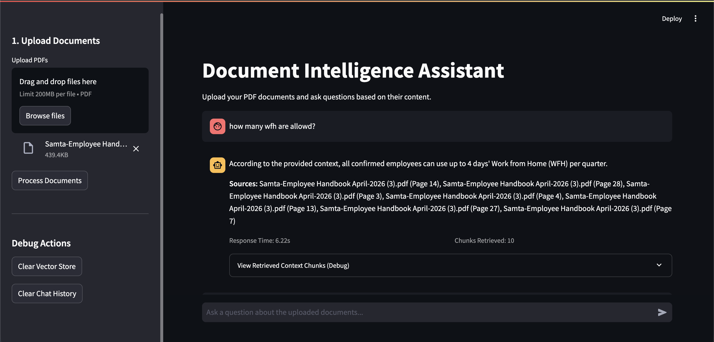
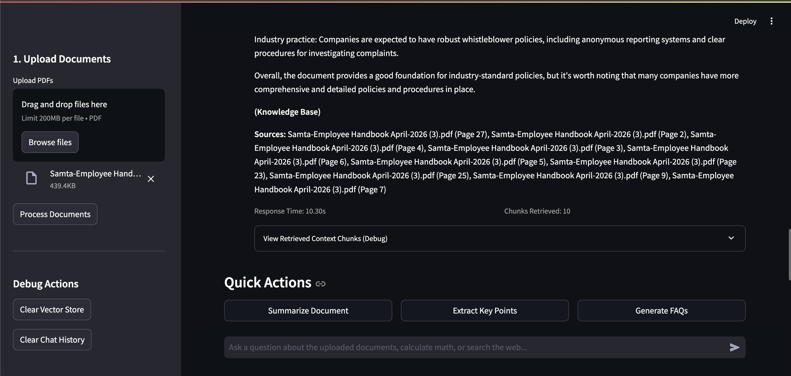
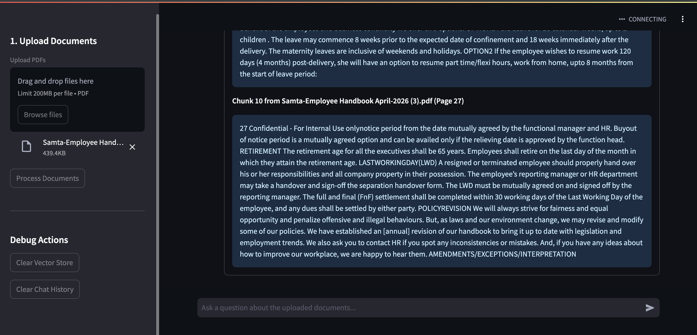

# Document Intelligence Assistant

This project was developed as part of an AI TDP hands-on initiative to demonstrate practical understanding of RAG, LangChain, embeddings, vector databases, and LLM orchestration.

An interview-ready, end-to-end Retrieval-Augmented Generation (RAG) application built with LangChain, ChromaDB, and Streamlit. This project allows users to upload PDF documents and query them using an LLM, generating answers based strictly on the provided context.

## Problem Statement
Finding specific information across multiple large PDF documents is time-consuming and error-prone. Traditional keyword search often falls short of understanding context and nuance. This application solves that problem by semantically searching documents and synthesizing precise, context-aware answers with exact source citations.

## Features
- **Multi-Document Support**: Upload and process one or multiple PDF documents simultaneously.
- **Accurate Citations**: Answers are backed by source file names and page numbers.
- **Strict Context Boundaries**: The LLM is instructed to only use the retrieved context. If the answer isn't in the text, it honestly replies that it cannot find the information, preventing hallucinations.
- **Transparent Retrieval (Debug Mode)**: Users can expand a section to see the exact chunks of text retrieved by the vector database, complete with their metadata.
- **Performance Metrics**: View response times and the number of chunks retrieved for each query.
- **Chat History**: Maintains session state for a conversational experience.
- **Semantic Routing**: Intelligently routes queries to the Knowledge Base, a Web Search Tool, or a Math Calculator based on intent.
- **Document Quick Actions**: One-click buttons to summarize documents, extract key points, or generate FAQs.

## Architecture



## Tech Stack
- **Frontend**: Streamlit
- **Orchestration**: LangChain
- **LLM**: Groq (`llama-3.1-8b-instant`) for fast inference
- **Embeddings**: HuggingFace (`all-MiniLM-L6-v2`) via `sentence-transformers`
- **Vector Database**: ChromaDB (local persistence)
- **Document Processing**: PyPDFLoader (LangChain)
- **External Tools**: `duckduckgo-search` (Web Search) and `numexpr` (Safe Math Evaluation)

## Setup Instructions

1. **Clone the repository:**
   ```bash
   git clone https://github.com/Pradhuman0012/Document-Intelligence-Assistant.git
   cd Document-Intelligence-Assistant
   ```

2. **Create a virtual environment:**
   ```bash
   python -m venv venv
   source venv/bin/activate  # On Windows use `venv\Scripts\activate`
   ```

3. **Install dependencies:**
   ```bash
   pip install -r requirements.txt
   ```

4. **Environment Variables:**
   Copy `.env.example` to `.env` and fill in your Groq API key.
   ```bash
   cp .env.example .env
   # Edit .env with your favorite editor
   ```

5. **Run the Application:**
   ```bash
   streamlit run app.py
   ```


## Screenshots

### Home Screen



### Question Answering



### Source Citations & Retrieved Context




## Example Questions
Upload a document (e.g., an employee handbook or technical manual) and ask:
- *"What is the policy on remote work according to page 4?"* (Routes to Knowledge Base)
- *"Summarize the main steps for troubleshooting the network module."* (Routes to Summarizer)
- *"What is 15% of 15000?"* (Routes to Calculator Tool)
- *"Who won the world cup in 2022?"* (Routes to Web Search Tool)
- *"Compare this remote work policy with current industry practices."* (Uses Knowledge Base + LLM external knowledge)

## Interview Guide: Refactoring Process & Decisions

### What was Reused
- The original logic for document parsing (`PyPDF2` upgraded to `langchain-community` PyPDFLoader for built-in metadata support).
- The embedding model choice (`sentence-transformers/all-MiniLM-L6-v2`) as it provides an excellent balance of speed and semantic quality.
- The choice of LLM (`ChatGroq` / `llama-3.1-8b-instant`).

### What was Refactored
- **Architecture**: Moved from a monolithic Jupyter Notebook / single script into a structured backend (`src/` folder containing `config.py`, `document_loader.py`, `text_splitter.py`, `vector_store.py`, `llm.py`, `rag_service.py`). This promotes separation of concerns and testability.
- **Vector Store**: Migrated from FAISS to ChromaDB. ChromaDB is purpose-built for AI applications, offers built-in persistence, and integrates seamlessly with LangChain's document abstractions.
- **RAG Pipeline**: Replaced a broad `ZERO_SHOT_REACT_DESCRIPTION` Agent (which could hallucinate or use outside knowledge) with a strictly controlled `create_retrieval_chain`. This ensures the application acts purely as a Knowledge Base Assistant.
- **UI/UX**: Replaced the rudimentary inputs with a full chat interface using Streamlit's `st.chat_message` and session state.

### New Features Added
- **Semantic Routing & Tools**: Added multi-tool support (Web Search, Calculator, Summarizer) without the unpredictability of a monolithic Agent. A zero-shot semantic router categorizes intent to trigger the correct path, ensuring the RAG pipeline remains intact.
- **Citations & Metadata**: Added extraction and propagation of `source` and `page` metadata through the chunking and retrieval process, surfacing them in the UI.
- **Debug Expander**: Added an expandable section to inspect raw retrieved chunks.
- **Performance Tracking**: Added a `@time_it` decorator to measure inference speed.

### Limitations & Future Improvements
- **Document Support**: Currently limited to PDFs. Could be expanded to DOCX, TXT, and Web pages using LangChain's loaders.
- **Chunking Strategy**: Currently uses naive recursive character splitting. Semantic chunking or document-specific chunking (e.g., Markdown header splitting) could improve retrieval quality.
- **Vector DB Scale**: Local ChromaDB is great for prototyping. For production scale, it could be swapped out for a hosted solution like Pinecone or Qdrant.

## Why this project matters for Backend/AI Engineering
This project demonstrates the ability to take an AI prototype and engineer it into a robust software product. It showcases an understanding of modular architecture, environment management, the mechanics of Retrieval-Augmented Generation (RAG), and the critical importance of preventing LLM hallucinations through strict prompting and reliable vector search.
